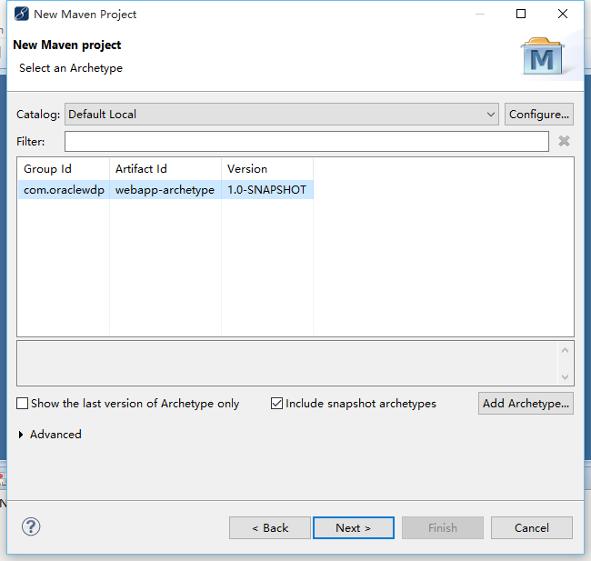
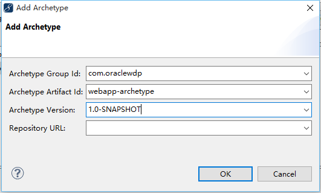
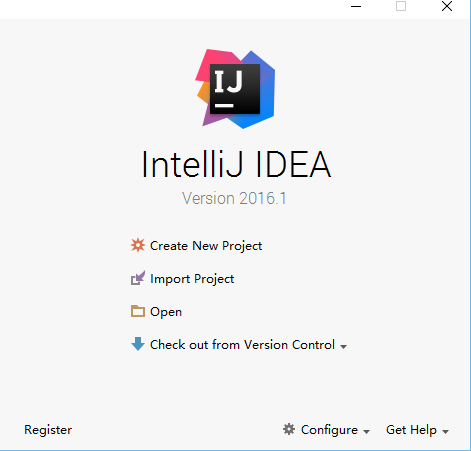
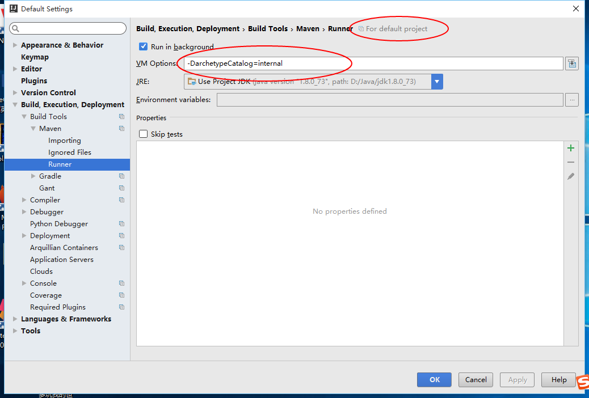
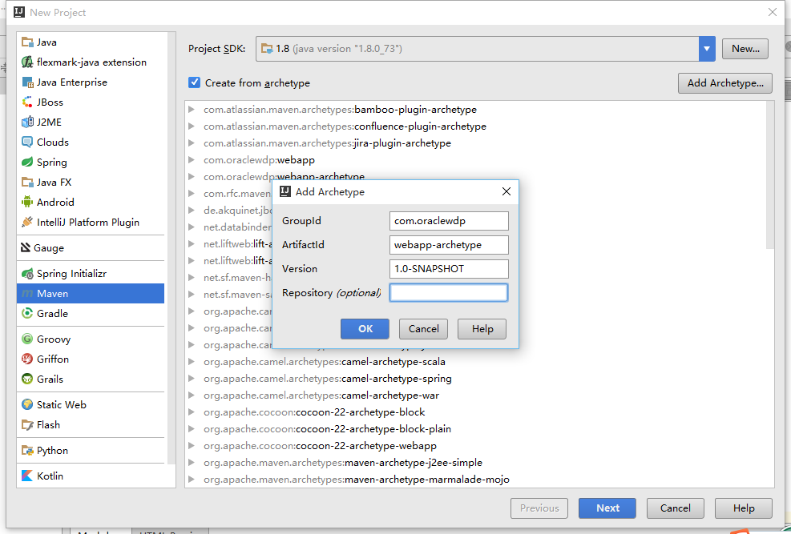

#webapp archetype

##oraclewdp maven webapp 构建

---


##1.从coding上克隆出完整的项目

`git clone https://git.coding.net/xcr_abcd/webapp-archetype.git`

##2.安装到本地maven仓库中

安装maven，并配置好maven环境变量，进入克隆出的目录。

`mvn install`

##3.构造webapp.


|   属性名  |  值  |
|---|---|
|   groupId |   com.oraclewdp   |
|   artifactId  |   webapp-archetype    |
|   version |   1.0-SNAPSHOT    |


###用命令行构建（推荐）

在linux下，执行

```bash
 mvn archetype:generate                          \
   -DarchetypeGroupId=com.oraclewdp              \
   -DarchetypeArtifactId=webapp-archetype        \
   -DarchetypeVersion=1.0-SNAPSHOT               \
   -DgroupId=com.mycompany                       \
   -DartifactId=mywebapp                         \
   -Dversion=1.0                                 \
   -DarchetypeCatalog=local
```

在windows中，执行  

`mvn archetype:generate -DarchetypeGroupId=com.oraclewdp -DarchetypeArtifactId=webapp-archetype -DarchetypeCatalog=local -DarchetypeVersion=1.0-SNAPSHOT -DgroupId=com.mycompany -DartifactId=mywebapp -Dversion=1.0`  

将其中的-DgroupId、-DartifactId和-Dversion换成你自己的。

###用MyEclipse构建

MyEclipse的updating indexes功能,在开发maven项目的时候有问题，建议关闭这项功能。

Window => Preferences => Myeclipse Enterprise Workbench => Maven4Myeclipse => Maven=>禁用Download repository index updates on startup

新建maven项目，不要勾选create simple project(skip archetype selection)

Catalog选择Default Local，勾选Include snapshot archetypes.



如果列表中没有该项，则点击Add Archetype手动添加



###用IntelliJ IDEA构建

在开始界面进行如下设置




-DarchetypeCatalog=internal  



新建Maven Project，勾选use from archetype,点击add archetype



在下方选中com.oraclewdp:webapp-archetype，点击Next.